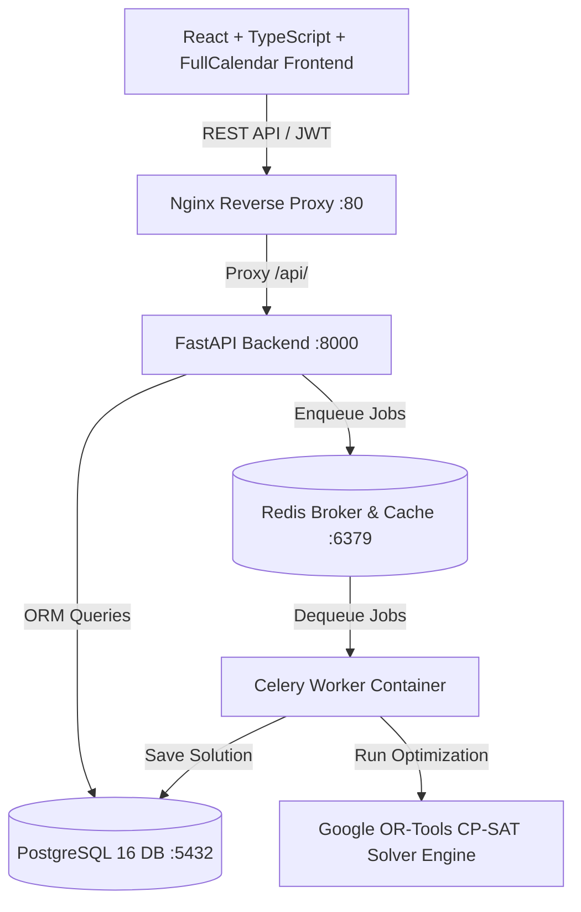

# Staff Scheduler — Enterprise Constraint-Based Scheduling Web Application

[](LICENSE)
[](backend/)
[](backend/)
[](frontend/)
[](frontend/)
[](backend/app/solver/)
[](backend/app/tasks/)

Staff Scheduler is an internal enterprise staff scheduling web application built for managing shift assignments across ~50 employees. Powered by a **Google OR-Tools CP-SAT constraint solver** and a multi-tiered rules engine, the platform automatically generates optimal monthly work schedules while respecting complex labor laws, worker availability, night rest windows, contract hour limits, and weekend constraints.

---

## Key Features

* 🗓️ **Interactive Drag-and-Drop Editor**: Powered by FullCalendar with real-time rule validation, worker detail drawers, and floating context menus.
* 🧠 **Google OR-Tools CP-SAT Solver**: Solves thousands of variables in seconds to maximize shift coverage and fairness.
* 🔒 **Assignment Locking**: Schedulers can lock specific shift assignments; the solver re-runs without mutating locked shifts.
* ⚡ **Asynchronous Celery & Redis Jobs**: Non-blocking background job queue for long-running schedule optimization and rebalancing.
* 🛡️ **Rule Engine & Conflict Inspector**: Hard and soft constraint evaluation with diagnostic reports highlighting exact rule violations.
* 🔑 **JWT & Role-Based Access Control**: Secure token authentication supporting `ADMIN`, `SCHEDULER`, and `EMPLOYEE` roles.
* 📊 **Coverage & Diagnostic Dashboards**: Real-time visual metrics for contract hour fulfillment, worker statistics, and system audit logs.

---

## Tech Stack

* **Frontend**: React 18, TypeScript, FullCalendar, Tailwind CSS, Vite, Axios
* **Backend**: Python 3.12, FastAPI, SQLAlchemy 2.0, Pydantic v2, Alembic
* **Constraint Solver**: Google OR-Tools CP-SAT (Constraint Programming - Satisfiability)
* **Background Tasks**: Celery, Redis 7
* **Database**: PostgreSQL 16
* **Containerization & Web Server**: Docker, Docker Compose, Nginx

---

## System Architecture



---

## Quickstart & Local Setup

### Prerequisites
* Docker & Docker Compose (v2.20+)
* Node.js 20+ & Python 3.12+ (for non-Docker local development)

### Running with Docker Compose (Recommended)

1. **Clone Repository**:
   ```bash
   git clone https://github.com/cybertajik/Scheduler.git
   cd Scheduler
   ```

2. **Launch Services**:
   ```bash
   docker-compose up -d --build
   ```

3. **Access Application**:
   * **Frontend Web App**: `http://localhost/`
   * **FastAPI OpenAPI Documentation**: `http://localhost:8000/docs`
   * **Health Endpoint**: `http://localhost:8000/api/v1/health`

4. **Default Admin Login Credentials**:
   * **Email**: `admin@admin.com`
   * **Password**: `!23QWEasd`

---

## Project Structure

```text
Scheduler/
├── backend/                  # FastAPI Python backend service
│   ├── app/
│   │   ├── api/v1/          # REST endpoints (auth, workers, schedules, rules, jobs)
│   │   ├── core/            # Config, database setup, security, Celery app
│   │   ├── models/          # SQLAlchemy ORM models
│   │   ├── rules/           # Hard & soft constraint evaluation engine
│   │   ├── services/        # Business logic services
│   │   ├── solver/          # Google OR-Tools CP-SAT integration & diagnostics
│   │   └── tasks/           # Celery background tasks
│   └── tests/               # Pytest suite (44 passing tests)
├── frontend/                 # React TypeScript frontend app
│   ├── src/
│   │   ├── components/      # UI components & Schedule Editor modules
│   │   ├── context/         # Auth & global context
│   │   ├── hooks/           # Custom hooks (useScheduleHistory)
│   │   ├── pages/           # Application views
│   │   └── services/        # Typed API service modules
│   └── public/              # Static assets
├── docs/                     # Project technical documentation
├── ADR/                      # Architectural Decision Records (0001-0009)
└── docker-compose.yml        # Multi-container service orchestrator
```

---

## Documentation Index

Detailed technical documentation is available in the [`docs/`](docs/) directory:

* 🏗️ [Architecture Overview](docs/architecture.md)
* 🐍 [Backend Architecture](docs/backend.md)
* ⚛️ [Frontend Architecture](docs/frontend.md)
* 🗄️ [Database Schema & ERD](docs/database.md)
* 🔌 [REST API Specification](docs/api.md)
* 🧠 [Rules Engine Specification](docs/rules-engine.md)
* ⚙️ [Google OR-Tools Solver Guide](docs/solver.md)
* ⚡ [Celery & Redis Task Processing](docs/celery.md)
* 🔒 [Security & RBAC Model](docs/security.md)
* 🧪 [Testing Strategy & Reports](docs/testing.md)

---

## License

This project is licensed under the [MIT License](LICENSE).
