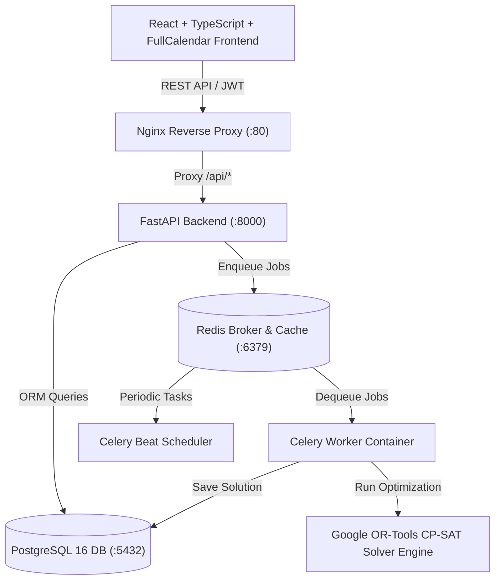

# Staff Scheduler -- Enterprise Constraint-Based Scheduling Platform

[](LICENSE)
[](backend/)
[](backend/)
[](frontend/)
[](frontend/)
[](backend/app/solver/)
[](backend/app/tasks/)

Staff Scheduler is an enterprise multi-tenant SaaS web application for managing employee shift schedules across organizations. Powered by a Google OR-Tools CP-SAT constraint solver and a multi-tiered rules engine, the platform automatically generates optimal monthly work schedules while respecting labor laws, employee availability, night rest windows, contract hour limits, and weekend constraints.

---

## Table of Contents

- [Features Overview](#features-overview)
- [Technology Stack](#technology-stack)
- [System Architecture](#system-architecture)
- [Prerequisites and System Requirements](#prerequisites-and-system-requirements)
- [Deployment Guide](#deployment-guide)
- [Default Credentials](#default-credentials)
- [Project Structure](#project-structure)
- [Comprehensive Functionality Breakdown (A to Z)](#comprehensive-functionality-breakdown-a-to-z)
- [Testing](#testing)
- [Documentation Index](#documentation-index)
- [License](#license)

---

## Features Overview

### Multi-Tenant SaaS Platform
- Product Owner (Super Admin) governance panel for provisioning, suspending, and managing tenant organizations
- Self-service onboarding portal with application queue and approval workflow
- Per-organization data isolation across employees, departments, schedules, and rules
- Billing cycle management (Monthly / Annual / Quarterly), grace period extensions, and subscription lifecycle
- Internal admin notes system with individual note creation and deletion per organization

### Employee and Department Management
- Complete employee directory with contract type (Hourly / Salary), hire date, weekly hours, and contact details
- Department creation and assignment with organizational hierarchy
- Skill tagging system for competency-based shift matching
- Active / Inactive employee lifecycle management
- Employee detail pages with constraint history and shift assignment records

### Schedule Generation and Optimization
- Monthly schedule period creation (Draft, Generating, Published, Failed states)
- Google OR-Tools CP-SAT solver integration for automated schedule generation
- Assignment locking -- schedulers can lock specific shift assignments before running the solver
- Asynchronous Celery and Redis job queue for non-blocking optimization
- Schedule re-run capability preserving locked assignments
- Infeasibility diagnostics when the solver cannot find a valid solution

### Rules Engine and Constraint System
- Hard constraints (mandatory): Vacation periods, no-weekend rules, maximum consecutive shifts
- Soft constraints (penalized): Preferred days off, workload balancing preferences
- Per-employee constraint configuration with date ranges and priority levels
- Night shift rest enforcement (minimum 11-hour gap between shifts)
- Weekend rotation fairness across employee pool
- Contract hour limit enforcement against weekly maximums

### Conflict Detection and Resolution
- Real-time conflict inspector evaluating all hard and soft constraint violations
- Diagnostic reports showing exact rule violations per employee and date
- Coverage analysis with fulfillment rate calculation
- Conflict severity classification (Hard vs. Soft) with penalty scoring

### Interactive Schedule Editor
- Drag-and-drop shift assignment interface
- Classic calendar view and Excel-style roster grid view
- Employee detail drawers with floating context menus
- Real-time rule validation on manual edits
- Undo / Redo history for all schedule modifications

### Analytics and Reporting
- Organization Manager view: Daily coverage charts, employee workload distribution, department assignment shares, schedule comparison tables (pure SVG, dependency-free)
- Product Owner view: Platform-level system health metrics, active organization count, pending onboarding queue, database latency, solver cluster status, support ticket log

### Import and Export
- CSV employee import with dry-run validation and error reporting
- CSV formula injection protection (neutralizes `=`, `+`, `-`, `@` prefixes)
- Employee roster CSV export with tenant-scoped data isolation
- Schedule export in CSV, Excel (XLSX), and JSON formats
- Audit log CSV export

### Security and Access Control
- JWT token authentication with access and refresh token flow
- Role-Based Access Control: SUPER_ADMIN, ORG_ADMIN, SCHEDULER, MANAGER, EMPLOYEE
- Product Owner route isolation (cannot access tenant operational pages)
- Organization Manager route isolation (cannot access platform governance pages)
- Token type validation (access vs. refresh token confusion prevention)
- 5MB file upload size enforcement
- Security headers: X-Frame-Options, X-XSS-Protection, X-Content-Type-Options

### System Administration
- System status dashboard with container health monitoring
- Structured request logging middleware with audit trail
- Audit log with user, action, entity tracking, and IP address capture
- Celery worker and beat scheduler monitoring
- Automated PostgreSQL backup scripts with SHA-256 verification

---

## Technology Stack

| Layer | Technology | Version | Purpose |
|-------|-----------|---------|---------|
| Frontend UI | React | 18.2 | Component-based SPA architecture |
| Language (Frontend) | TypeScript | 5.2 | Static typing and interface enforcement |
| Build Tool | Vite | 5.0 | High-performance ES module bundler |
| UI Icons & Styling | Lucide React, Vanilla CSS | 0.300+ | Icons, glassmorphism dark theme & light mode |
| HTTP Client | Axios | 1.6 | REST API client with JWT interceptors |
| Calendar Engine | FullCalendar | 6.1 | Drag-and-drop schedule editing |
| Backend API | FastAPI | 0.109.0 | High-performance asynchronous ASGI Web Framework |
| Language (Backend) | Python | 3.12 | Core backend runtime environment |
| ORM & DB Driver | SQLAlchemy, asyncpg | 2.0 / 0.29 | Database models and asynchronous PostgreSQL access |
| Data Validation | Pydantic | v2 | Request/Response schema validation |
| Constraint Solver | Google OR-Tools | CP-SAT | Mathematical constraint programming solver engine |
| Background Jobs | Celery | 5.3 | Distributed task processing for solver execution |
| Message Broker | Redis | 7.2 | Celery queue broker and task result cache |
| Database | PostgreSQL | 16 | Relational database with persistent storage volume |
| Reverse Proxy | Nginx | 1.25 | Web server, static asset hosting, SSL & reverse proxy |
| Security | PyJWT, passlib / bcrypt | 2.8 / 4.1 | JWT token security and password hashing |
| Unit Testing | Pytest, Vitest | Latest | Backend and frontend unit/component testing |
| E2E Testing | Playwright | 1.40+ | End-to-end user interaction test automation |
| Containerization | Docker, Docker Compose | v2.20+ | Multi-container environment orchestration |

---

## System Architecture



---

## Prerequisites and System Requirements

### Hardware Requirements
- **CPU**: 2 Cores minimum (4 Cores recommended for solver workloads)
- **RAM**: 4 GB minimum (8 GB recommended)
- **Disk Space**: 10 GB available SSD storage

### Software Requirements
- **Docker and Docker Compose**: Docker v24.0+ and Docker Compose v2.20+
- **Git**: v2.30+
- **Local Development (Non-Docker)**:
  - Node.js v20.x or higher
  - Python 3.12.x
  - PostgreSQL 16
  - Redis 7.x

---

## Deployment Guide

### Option 1: Docker Compose Deployment (Production / Staging)

1. **Clone the repository**:
   ```bash
   git clone https://github.com/cybertajik/Scheduler.git
   cd Scheduler
   ```

2. **Configure Environment Variables**:
   Copy `.env.example` to `.env` or set environment variables:
   ```bash
   cp .env.example .env
   ```

3. **Launch Docker Services**:
   ```bash
   docker compose up -d --build
   ```
   This orchestrates 6 containerized services:
   - `scheduler_db` (PostgreSQL 16)
   - `scheduler_redis` (Redis 7)
   - `scheduler_backend` (FastAPI API server on port 8000)
   - `scheduler_frontend` (Nginx + React SPA on port 80)
   - `scheduler_celery_worker` (Celery background worker)
   - `scheduler_celery_beat` (Celery cron scheduler)

4. **Verify Health Status**:
   ```bash
   docker compose ps
   curl http://localhost:8000/api/v1/health
   ```
   Expected response: `{"status":"healthy","database":true,"redis":true,"version":"1.0.0"}`

5. **Access Application Endpoints**:
   - Web Application: `http://localhost/`
   - API OpenAPI Docs (Swagger): `http://localhost:8000/docs`
   - API ReDoc Specs: `http://localhost:8000/redoc`

---

### Option 2: Remote Automated Server Deployment

The repository includes an automated Python remote deployment script (`deploy_remote_stack.py`):
- Connects via SSH to target server
- Transfers codebase via SFTP
- Builds Docker images remotely
- Executes container health checks

```bash
python deploy_remote_stack.py
```

---

### Option 3: Local Non-Docker Development

#### Backend Setup:
```bash
cd backend
python -m venv .venv
source .venv/bin/activate  # On Windows: .venv\Scripts\activate
pip install -r requirements.txt
uvicorn app.main:app --reload --port 8000
```

#### Frontend Setup:
```bash
cd frontend
npm install
npm run dev
```

---

### Option 4: Database Reset and Seeding

To clean the database and populate seed organizations, users, employees, shift types, and schedules:
```bash
python reset_and_seed_db.py
```

---

## Default Credentials

| Account Role | Username / Email | Default Password | Permission Scope |
|--------------|------------------|------------------|------------------|
| Product Owner | `admin@admin.com` | `!23QWEasd` | Super Admin governance, organization provisioning, notes management |
| Test Org 1 Manager | `testorg1@org.com` | `!23QWEasd` | Organization Admin for Test Org 1 |
| Test Org 2 Manager | `testorg2@org.com` | `!23QWEasd` | Organization Admin for Test Org 2 |

---

## Project Structure

```
Scheduler/
|-- backend/                      # FastAPI Python backend service
|   |-- app/
|   |   |-- api/v1/              # REST endpoints (auth, employees, schedules, rules, jobs, analytics, import/export, organizations, onboarding)
|   |   |-- core/                # Config, database setup, security, Celery app, middleware
|   |   |-- models/              # SQLAlchemy ORM models (User, Organization, Worker, Department, ShiftType, Schedule, etc.)
|   |   |-- rules/               # Hard and soft constraint evaluation engine
|   |   |-- services/            # Business logic services (auth, schedule, solver, export, import, audit, organization, onboarding)
|   |   |-- solver/              # Google OR-Tools CP-SAT integration and diagnostics
|   |   |-- schemas/             # Pydantic request/response schemas
|   |   +-- tasks/               # Celery background tasks
|   +-- tests/                   # Pytest suite (71+ passing tests)
|-- frontend/                     # React TypeScript frontend application
|   |-- src/
|   |   |-- components/          # UI components (Sidebar, Navbar, Modal, StatusBadge, Schedule Editor)
|   |   |-- context/             # React Context providers (Auth, Language, Theme)
|   |   |-- hooks/               # Custom hooks (useScheduleHistory for undo/redo)
|   |   |-- i18n/                # Internationalization translations (9 languages)
|   |   |-- pages/               # Application views (18 pages)
|   |   +-- services/            # Typed API service modules
|   +-- public/                  # Static assets
|-- e2e/                          # Playwright end-to-end test specifications
|-- docs/                         # Technical documentation suite
|-- ADR/                          # Architectural Decision Records
|-- scripts/                      # Backup, restore, update, and rollback scripts
|-- .github/workflows/            # GitHub Actions CI/CD pipeline
|-- docker-compose.yml            # Multi-container service orchestrator
|-- deploy_remote_stack.py        # Remote SSH deployment script
+-- reset_and_seed_db.py          # Database reset and sample data seed script
```

---

## Comprehensive Functionality Breakdown (A to Z)

Below is an alphabetical functional overview showing the complete scope of the platform:

- **A - Authentication & Authorization**: Dual JWT token mechanism (Access & Refresh tokens), bcrypt password encryption, and Role-Based Access Control (RBAC) across 5 roles: `SUPER_ADMIN`, `ORG_ADMIN`, `SCHEDULER`, `MANAGER`, and `EMPLOYEE`.
- **B - Billing & Subscription Governance**: Super Admin subscription control for managing billing cycles (Monthly, Quarterly, Annual), tracking grace periods, extending access, suspending accounts, and reactivating tenant organizations.
- **C - Constraint Engine & Conflict Diagnostics**: Real-time evaluation of hard constraints (vacations, rest days, weekly contract hours) and soft constraints (shift preferences, weekend fairness) with exact violation reports.
- **D - Department Management**: Hierarchical structuring of tenant organizations into functional departments with employee assignment and department-level reporting.
- **E - Employee Roster Management**: Full employee CRUD lifecycle management, including contract details (Hourly vs. Salary), weekly hour targets, contact info, active status toggling, and skill tagging.
- **F - Fulfillment & Coverage Analytics**: Real-time analytics measuring shift coverage percentages, missing staffing headcount, and contractual hour distribution using lightweight SVG charts.
- **G - Global Multilingual & Accessibility Support**: Built-in 9-language translation system (English, German, French, Spanish, Arabic, Russian, Chinese, Portuguese, Italian) with native RTL support for Arabic and persistent theme options.
- **H - Health Checks & System Monitoring**: Live platform telemetry tracking API latency, database connection status, Redis message queues, container health, and active Celery background workers.
- **I - Import & Export Wizard**: CSV and Excel (XLSX) bulk data processing. Features dry-run validation before committing employee imports, CSV formula injection sanitization, and multi-format schedule exports (CSV, XLSX, JSON).
- **J - Job Processing & Asynchronous Solver**: Distributed background task execution using Celery and Redis. Prevents HTTP request timeouts by processing long-running schedule optimization jobs in separate worker containers.
- **K - Key-Lock Shift Protection**: Manual shift locking feature allowing schedulers to freeze specific employee shift assignments before executing the auto-solver.
- **L - Logging & Audit Trail**: Automated security audit logging capturing user actions, IP addresses, resource modifications, and login events.
- **M - Multi-Tenant Isolation & Super Admin Notes**: Complete data isolation per organization. Super Admins can add, inspect, and delete individual private administrative notes per tenant for tracking billing history, contracts, or support context.
- **N - Night Shift Rest Period Enforcement**: Automated labor law compliance enforcing a minimum 11-hour rest window following night shifts to prevent consecutive overnight fatigue.
- **O - Onboarding Workflow**: Self-service application queue where prospective organizations submit requests, allowing Super Admins to review, approve, or reject applications with automatic tenant provisioning.
- **P - Publishing & Period Lifecycle**: Schedule state machine managing draft creation, optimization execution, conflict review, final publishing, and historical period archive.
- **Q - Quality Assurance & CI/CD**: Suite of automated tests including 71+ Pytest backend unit/integration tests, Vitest component tests, Playwright E2E browser automation, and GitHub Actions CI pipelines.
- **R - Roster Editing Views**: Flexible dual-mode schedule editor offering both a FullCalendar drag-and-drop calendar view and a spreadsheet-like Excel Roster View with instant Undo/Redo capabilities.
- **S - Solver Optimization (Google OR-Tools)**: Advanced CP-SAT mathematical solver engine transforming complex scheduling constraints into satisfiability equations to generate optimal rosters.
- **T - Tenant Security Scope**: Middleware-enforced multi-tenancy preventing cross-tenant data leakage by automatically scoping all database operations to `organization_id`.
- **U - User Account & Profile Settings**: Tenant user account administration, password update flows, avatar initials, and language/theme preference management.
- **V - Vacation & Unavailability Tracking**: Date-ranged leave tracking and custom unavailability rule definition per employee with priority ranking.
- **W - Workflow Automation**: Celery Beat cron scheduling for automated task execution, daily system checks, and PostgreSQL database backup pruning.
- **X - Cross-Platform Compatibility**: Fully responsive glassmorphism dark and light web design optimized across desktop monitors, laptops, and tablets.
- **Y - Yield & Workload Balancing**: Fair rotation solver algorithms ensuring equitable distribution of weekend shifts, night shifts, and holiday duties across the employee pool.
- **Z - Zero-Downtime Operations & Database Recovery**: Automated database backup scripts with SHA-256 checksum verification, retention policies, and single-command disaster recovery protocols.

---

## Testing

### Backend Unit & Integration Tests (Pytest)
```bash
cd backend
pytest --cov=app --cov-report=html
```

### Frontend Component Tests (Vitest)
```bash
cd frontend
npm test
```

### End-to-End Browser Tests (Playwright)
```bash
npx playwright test
```

---

## Documentation Index

Comprehensive documentation is available in the `docs/` directory:

- [Architecture Overview](docs/architecture.md)
- [Backend Architecture](docs/backend.md)
- [Frontend Architecture](docs/frontend.md)
- [Database Schema and ERD](docs/database.md)
- [REST API Specification](docs/api.md)
- [Rules Engine Specification](docs/rules-engine.md)
- [Google OR-Tools Solver Guide](docs/solver.md)
- [Celery and Redis Task Processing](docs/celery.md)
- [Security and RBAC Model](docs/security.md)
- [Testing Strategy and Reports](docs/testing.md)

---

## License

This project is licensed under the [MIT License](LICENSE).
