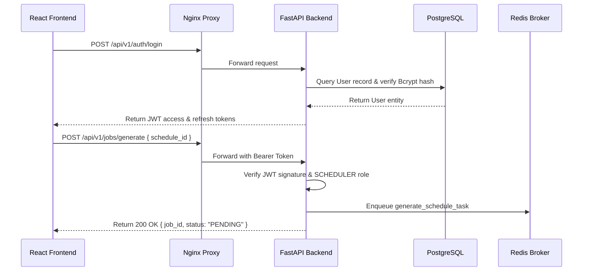

# Architecture Overview

## Complete System Architecture

The Staff Scheduler is a modular multi-tier enterprise web application designed for automated, constraint-based workforce scheduling.

```mermaid
graph TD
    User([Admin / Scheduler User]) -->|HTTPS / Port 80| Nginx[Nginx Reverse Proxy]
    Nginx -->|Static Assets| StaticFiles[Built Vite React Bundle]
    Nginx -->|/api/ Proxy| FastAPI[FastAPI REST Application]
    
    FastAPI -->|SQLAlchemy 2.0| Postgres[(PostgreSQL 16 Database)]
    FastAPI -->|Celery Task .delay()| Redis[(Redis 7 Broker & Result Backend)]
    
    Redis -->|Task Payload| CeleryWorker[Celery Worker Container]
    CeleryWorker -->|Run Solver| ORTools[Google OR-Tools CP-SAT Engine]
    CeleryWorker -->|Evaluate Constraints| RulesEngine[Rules Engine]
    CeleryWorker -->|Persist Assignments| Postgres
```

---

## Service Component Breakdown

1. **Nginx Reverse Proxy**: Receives client requests on port 80, serves production static React assets, and proxies `/api/` paths to the backend container.
2. **FastAPI Application**: Handles HTTP request parsing, JWT token authentication, business logic validation, CRUD database operations, and background job submission.
3. **PostgreSQL 16 Database**: Relational storage for users, workers, departments, shift definitions, rules/constraints, schedules, shift instances, assignments, and system audit logs.
4. **Redis 7 Broker & Cache**: In-memory data store providing Celery message queues and token blacklist storage for revoked JWT tokens.
5. **Celery Worker**: Asynchronous job runner executing long-running schedule optimization models and coverage recalculations.
6. **Google OR-Tools CP-SAT Solver**: Mathematical constraint programming solver engine.

---

## Request Lifecycle


