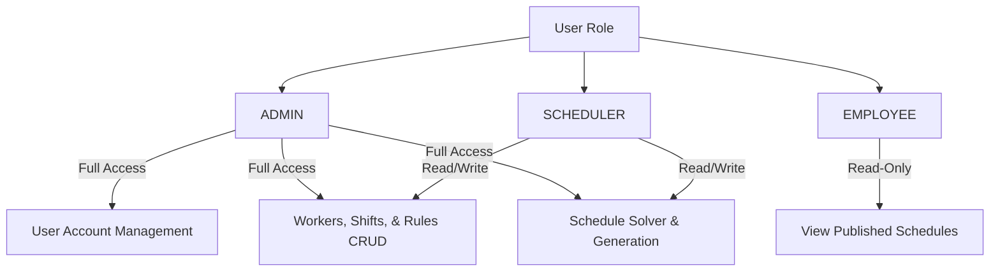

# Authentication & Authorization

## Overview
The application enforces stateless OAuth2 Bearer token authentication using JSON Web Tokens (JWT) signed with HMAC-SHA256 (`HS256`).

## Access & Refresh Token Lifetime
* **Access Tokens**: Expire in **30 minutes**.
* **Refresh Tokens**: Expire in **7 days**.

## Role-Based Access Control (RBAC)

