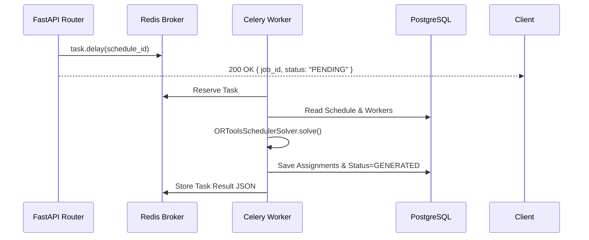

# Celery Background Task Processing

## Task Architecture

Long-running constraint solver executions are offloaded to Celery background tasks to prevent HTTP connection timeouts.

---

## Tasks Inventory

* **`generate_schedule_task(schedule_id: str)`**: Main background optimization task running CP-SAT.
* **`recalculate_coverage_task(schedule_id: str)`**: Computes worker coverage metrics and hours allocations.
* **`export_schedule_task(schedule_id: str, format: str)`**: Placeholder for CSV/PDF report generation.
* **`send_notification_task(schedule_id: str, message: str)`**: Placeholder for email alerts.
