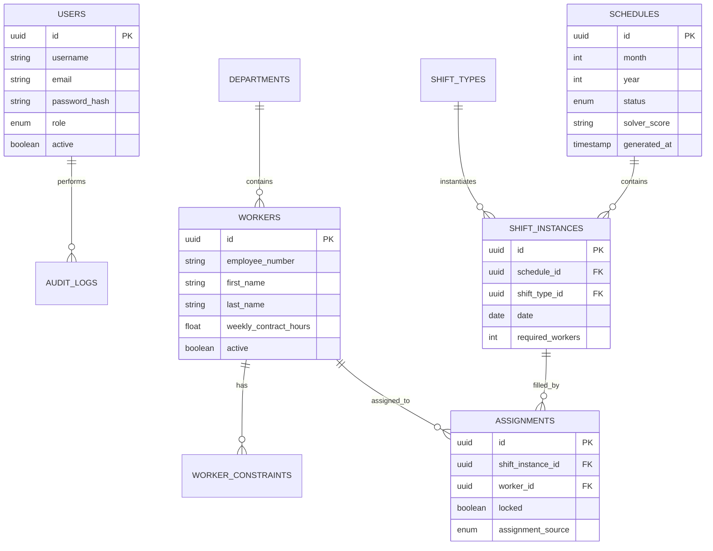

# Database Documentation & ERD

## Entity Relationship Diagram

---

## Tables Summary
* **`users`**: Administrative system accounts with role authorization (`ADMIN`, `SCHEDULER`, `EMPLOYEE`).
* **`workers`**: Employee roster containing contract hours and active status.
* **`schedules`**: Monthly schedule periods with solver score metadata.
* **`shift_instances`**: Daily demand requirements per shift type.
* **`assignments`**: Worker shift assignments with manual locking flags.
* **`worker_constraints`**: Worker availability rules and vacation dates.
* **`audit_logs`**: System audit trails recording user actions.
