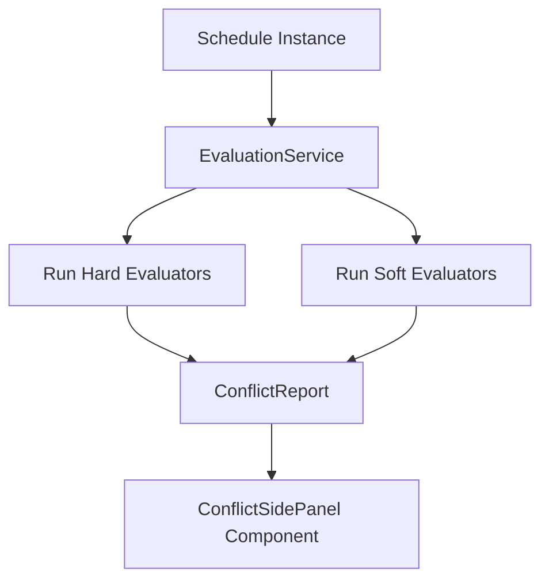

# Rules Engine & Constraint Evaluation

## Hard vs. Soft Constraints

* **Hard Constraints (Mandatory)**: Must never be violated under any circumstances.
  * **Vacation Overlap**: Worker cannot be assigned to shifts during approved vacation dates.
  * **Night Shift Rest Day**: A worker assigned to a night shift cannot be assigned to any shift on the following day.
  * **Skill Match**: Worker must possess required skills for specialized shifts.
  * **Duplicate Assignment**: Worker cannot work two overlapping shifts on the same day.

* **Soft Constraints (Preferences & Objectives)**: Penalized in objective function if violated.
  * **Fairness / Equal Distribution**: Minimizes variance in total worked hours across employees.
  * **Consecutive Work Days**: Penalizes assigning workers to >5 consecutive days.
  * **Weekend Shift Limits**: Penalizes assigning workers to both Saturday and Sunday.

---

## Conflict Diagnostic Flow

